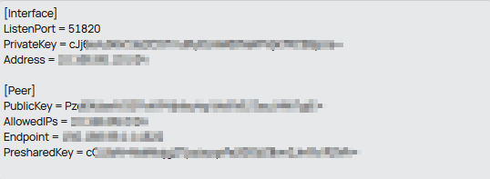
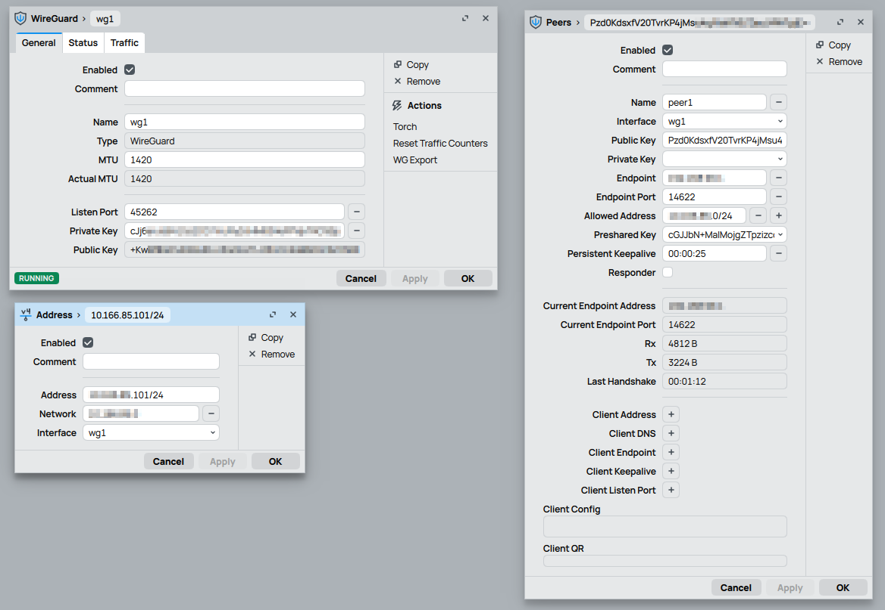
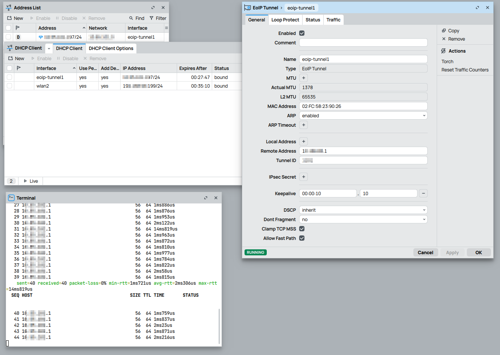
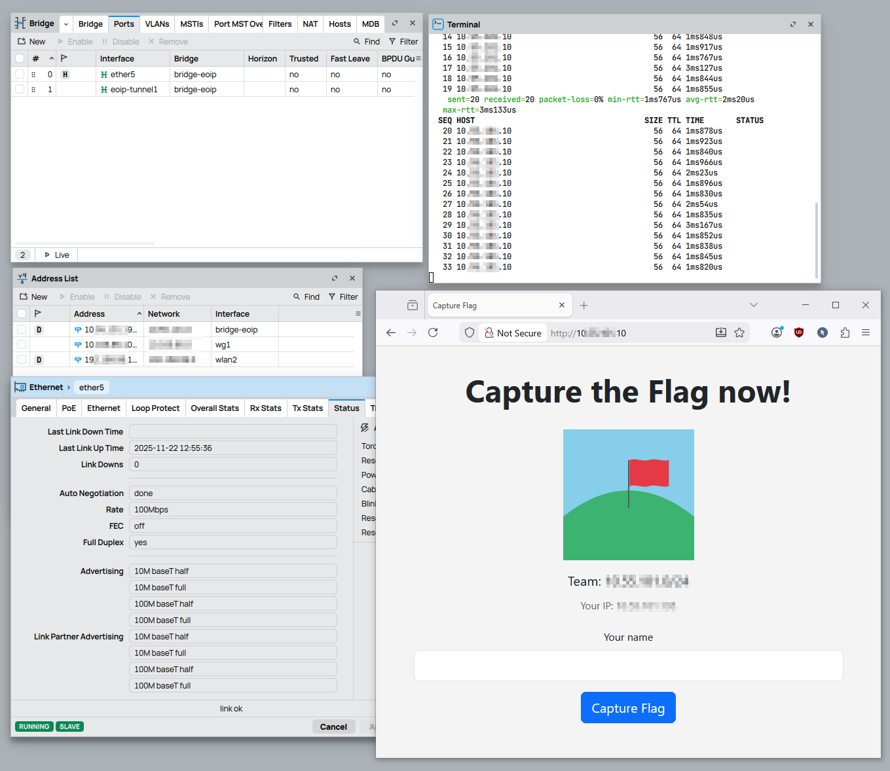

# Lab 1 - Capture The Flag - Combining WireGuard and EoIP<!-- omit in toc -->

## Table of contents <!-- omit in toc -->
- [1. Requirements](#1-requirements)
- [2. Learning objectives](#2-learning-objectives)
- [3. Preparation](#3-preparation)
- [4. Introduction](#4-introduction)
- [5. Connect to the Teacher's Network](#5-connect-to-the-teachers-network)
  - [5.1. Ressources - Wi-Fi / DCHP](#51-ressources---wi-fi--dchp)
- [6. WireGuard tunnel](#6-wireguard-tunnel)
  - [6.1. Ressources - WireGuard](#61-ressources---wireguard)
- [7. EoIP Tunnel](#7-eoip-tunnel)
  - [7.1. Ressources - EoIP](#71-ressources---eoip)
- [8. Capture The 🏴‍☠️](#8-capture-the-️)
  - [8.1. Ressources](#81-ressources)
- [9. License](#9-license)

## 1. Requirements 
 - Teacher's Lab Setup to connect to (usually a WiFi or a Switch to plug in own device)
 - [MikroTik hAP ac lite](https://mikrotik.com/product/RB952Ui-5ac2nD) or similar device

## 2. Learning objectives
 - Configure WireGuard on RouterOS (keys, interface, peers, allowed-IPs) and analyze tunnel operation.
 - Configure an EoIP tunnel on RouterOS
 - Combine WireGuard and EoIP

## 3. Preparation
 - Update your device to the newest RouterOS 7.x (2025-11-21, 7.20.x)
 - Reset your device with no default configuration `/system/reset-configuration no-defaults=yes skip-backup=yes`

## 4. Introduction

Your task is to reach the flag before anyone else. You must connect your router to the WiFi, establish the WireGuard tunnel, set up the EoIP tunnel, link your PC or laptop to the remote network, and access the target webserver in your browser.

 *Figure 1: Overview of the network.*

## 5. Connect to the Teacher's Network
Your course instructor will have a Wi-Fi network for you to connect your router. 

**💪 Challenge 1:** Connect your Router to the Wi-Fi network provieded by the course instructor. *Typically the SSID is `Capture The 🏴‍☠️`*

Connect to the Teacher's Network - Solution

Adjust SSID and pre-shared-key accordingly

<pre>
/interface/wireless/security-profiles/add name=CTF authentication-types=wpa2-psk wpa2-pre-shared-key=1234 mode=dynamic-keys
/interface wireless set [ find default-name=wlan2 ] ssid="Capture The \F0\9F\8F\B4\E2\80\8D\E2\98\A0\EF\B8\8F" band=5ghz-n/ac frequency=auto mode=ap-bridge  wps-mode=disabled security-profile=CTF disabled=no
/ip dhcp-client add interface=wlan2
</pre>

 

 *Figure 2: DHCP client successfully acquired an IP address from the teacher’s router.*

### 5.1. Ressources - Wi-Fi / DCHP
 - 📕 [MikroTik Help - Wi-Fi](https://help.mikrotik.com/docs/spaces/ROS/pages/224559120/WiFi)
 - 📕 [MikroTik Help - DHCP](https://help.mikrotik.com/docs/spaces/ROS/pages/24805500/DHCP)

## 6. WireGuard tunnel
**💪 Challenge 2:** Set up a WireGuard tunnel to the teacher’s router. A wg-quick configuration file is provided. Extract the interface address, peer public key, endpoint, listen port, and allowed-IPs from this file and configure the tunnel accordingly. The challenge is complete once the teacher’s router responds to ping over the WireGuard link.

 *Figure 3: DHCP client successfully acquired an IP address from the teacher’s router.*

WireGuard - Hint 1

1. Create new WireGuard interface 
2. Create new peer configuration 
3. Add IP adresss 
4. Ping the teachers router over the WireGuard tunnel

 

WireGuard - Soluton Hint

Once the tunnel is configured and the connection is established, the status should look like this:

 

### 6.1. Ressources - WireGuard
 - 🎥 [MikroTik Youtube - WireGuard](https://www.youtube.com/watch?v=vn9ky7p5ESM)
 - 📕 [MikroTik Help - MikroTik](https://help.mikrotik.com/docs/spaces/ROS/pages/69664792/WireGuard)

## 7. EoIP Tunnel
 Once the WireGuard tunnel is established, both peers have fixed IP addresses within the tunnel and can reach another. This is the requirement to build the EoIP tunnel. 

**💪 Challenge 3:** Configure the EoIP tunnel. This challenge is completed once a IP address was successfully aquired using DHCP over the EoIP tunnel. 

**Important:** Prevent the DHCP client from installing a default route or DNS entries to avoid configuration conflicts.. 

EoIP - Hint 1

 - Make sure to set the correct tunnel-id 
- Configure the DHCP client on the EoIP interface immediately after creating it. A successfully leased IP indicates that the tunnel is operational.

 

EoIP - Solution Hint

 

### 7.1. Ressources - EoIP
 - 📕 [MikroTik Help - EoIP](https://help.mikrotik.com/docs/spaces/ROS/pages/24805521/EoIP)

## 8. Capture The 🏴‍☠️ 

**💪 Challenge 4:** Access the remote network’s web interface from your laptop by creating a bridge and adding the EoIP interface as a bridge port. The DHCP client is not needed; remove it or move it to the bridge for verification. The webserver is in the same subnet and ends with `.10`. Connect your laptop to the bridge, reach the webserver, and capture the flag.

Capture The 🏴‍☠️  - Solution Hint

Once you reach the website, just enter your name and grab the flag… assuming no one beat you to it…

 

### 8.1. Ressources
 - 📕 [MikroTik Help - Bridging and Switching](https://help.mikrotik.com/docs/spaces/ROS/pages/328068/Bridging+and+Switching)

## 9. License
 This work is licensed under a <a rel="license" href="http://creativecommons.org/licenses/by-nc-sa/4.0/">Creative Commons Attribution-NonCommercial-ShareAlike 4.0 International License</a> and [GNU GENERAL PUBLIC LICENSE version 3](https://www.gnu.org/licenses/gpl-3.0.en.html). If there are any contradictions between the two licenses, the Attribution-NonCommercial-ShareAlike 4.0 International license govern