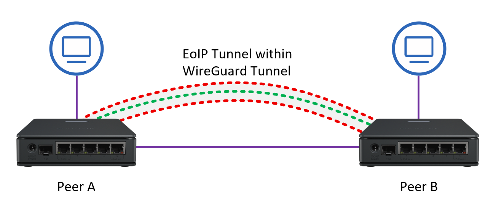
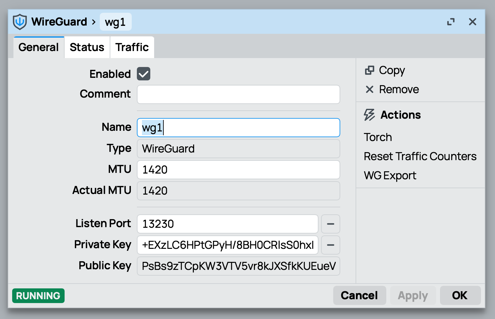
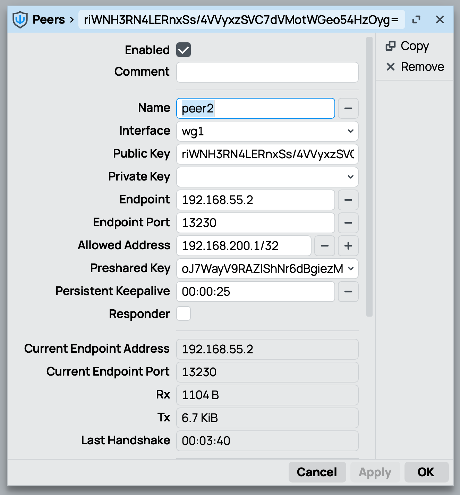
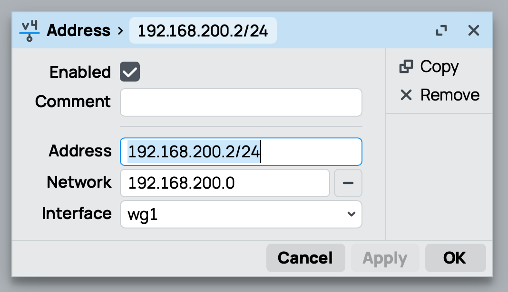
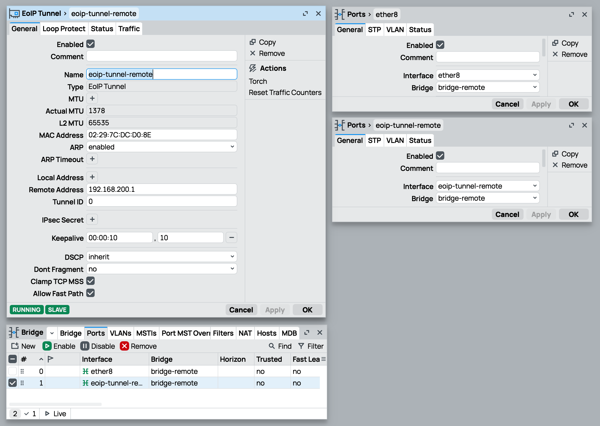

# Lab 2 - Build a tunnel to your neighbor <!-- omit in toc -->

## Table of contents <!-- omit in toc -->
- [1. Requirements](#1-requirements)
- [2. Learning objectives](#2-learning-objectives)
- [3. Preparation](#3-preparation)
- [4. Overview](#4-overview)
- [5. Basic setup - Uplink \& Local network](#5-basic-setup---uplink--local-network)
- [6. WireGuard](#6-wireguard)
- [7. EoIP](#7-eoip)
- [8. Troubleshooting](#8-troubleshooting)

## 1. Requirements 
 - [MikroTik hAP ac lite](https://mikrotik.com/product/RB952Ui-5ac2nD) or similar device for every student (=peer)

## 2. Learning objectives
 - Configure WireGuard on RouterOS (keys, interface, peers, allowed-IPs) and analyze tunnel operation.
 - Configure an EoIP tunnel on RouterOS
 - Combine WireGuard and EoIP

## 3. Preparation
 - Update your device to the newest RouterOS 7.x (2025-11-21, 7.20.x)
 - Reset your device with no default configuration `/system/reset-configuration no-defaults=yes skip-backup=yes`
 - Build a team of 2 or more people. (Solo: Have two RouterOS devices available)

## 4. Overview

## 5. Basic setup - Uplink & Local network

**💪 Challenge 1:** Coordinate with your teammate and define which IP addresses you want to use for your networks. To make the configuration simpler only use /24 networks. Define one local LAN for every peer, one network for WireGuard and one network between each peer. 

Solution: Example IP configuration

Adjust IP addresses to your linking

<pre>
Peer A Local network: 192.168.10.0/24
Peer B Local network: 192.168.20.0/24
Peer A to Peer B network: 192.168.50.0/24
   Peer A: 192.168.50.1/24
   Peer B: 192.168.50.2/24
WireGuard Network: 192.168.200.0/24
   Peer A: 192.168.200.1/24
   Peer B: 192.168.200.2/24
</pre>

 

**💪 Challenge 2:** On every peer: Make sure you have an uplink to the internet (via WiFi or Ethernet). Then configure a simple /24 local subnet on a bridge with DHCP server. Add all required NAT rules. Allow remote requests to your DNS. Make sure to allow ICMP in the firewall. Peer to peer reachability: Define one physical port that is not part of the local LAN and set a static IP address. Configure the defined IP addresses. 

Solution: Network configuration

Adjust IP address and bridge ports

<pre>
/interface bridge
add name=bridge-lan
/interface bridge port
add bridge=bridge interface=ether2
add bridge=bridge interface=ether3
add bridge=bridge interface=ether4
/ip address
add address=192.168.5.1/24 interface=bridge
/ip dhcp-client
add interface=ether1 use-peer-dns=yes add-default-route=yes disabled=no
/ip dns
set allow-remote-requests=yes
/ip pool
add name=pool-lan ranges=192.168.5.100-192.168.5.199
/ip dhcp-server
add name=dhcp-lan interface=bridge-lan address-pool=pool-lan lease-time=1d disabled=no
/ip dhcp-server network
add address=192.168.5.0/24 gateway=192.168.5.1 dns-server=192.168.5.1
/ip firewall nat
add chain=srcnat out-interface=ether1 action=masquerade 
</pre>

 

## 6. WireGuard 

**💪 Challenge 3:** On every peer: Configure WireGuard a interface and exchange the public key with the other peer. Configure the WireGuard peer and exchange the preshared key. The challenge is completed when both peer can ping each other over the WireGuard tunnel. 

Solution example: WireGuard Interface Configuration

 

Solution example: WireGuard Peer Configuration

 

Solution example: IP address configuration

 

## 7. EoIP

**💪 Challenge 4:** Configure the two EoIP interface on both peers: One to bridge the local network to the remote peer and one to "receive" the remote LAN. (Make sure that the EoIP tunnel uses goes through the WireGuard.  We do not need double encryption: Do not set IPsec-secret). Bridge one EoIP interface to your local LAN and the other to a free physical port. The challenge is completed when you can access the internet through the others LAN over the EoIP tunnel. 

Solution example: EoIP to remote network

 

## 8. Troubleshooting
Verify the following things:
 - Can the router ping the internet?
 - Can the router ping the other router?
 - Not a requirement but helpful: Do both students have different subnet ranges in their subnets?
 - Is the WireGuard tunnel actually up?   If a persistent keep-alive is configured you can verify that by looking at your increasing TX and RX and by being able to ping the other peer over the tunnel.
 - Is the EoIP tunnel running?